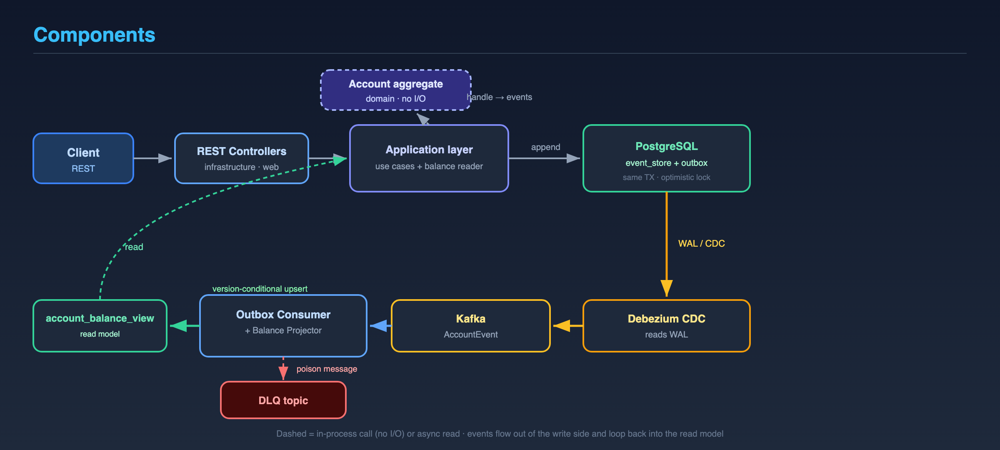
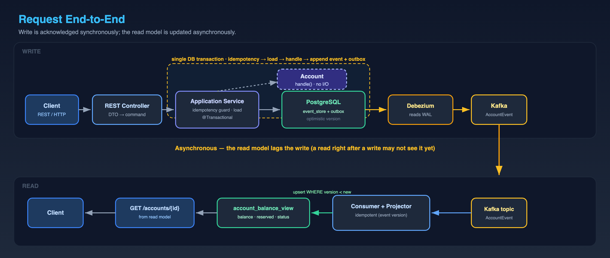

# Account

A banking account that holds money in one currency and supports deposits,
withdrawals, and two-phase fund reservations.

For the full text, see **[Business flows](./business-flows.md)** (the rules) and
**[Runtime architecture](./architecture.md)** (how it works). The editable SVG
sources and their PNG exports live in **[`diagrams/`](./diagrams/)**.

---

## Account lifecycle

An account is opened, used, then closed.

## Money reservations (two-phase hold)

Funds can be held, then either captured (settled) or cancelled (released).

## How it works — components

The parts that handle a request and keep the read model up to date.

## How it works — a request end to end

A write is acknowledged immediately; the read model catches up a moment later.

