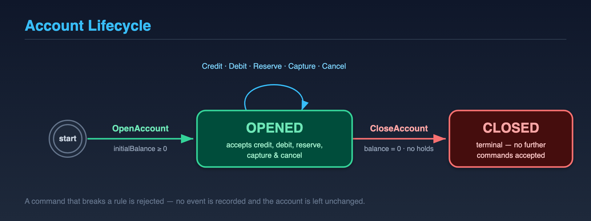
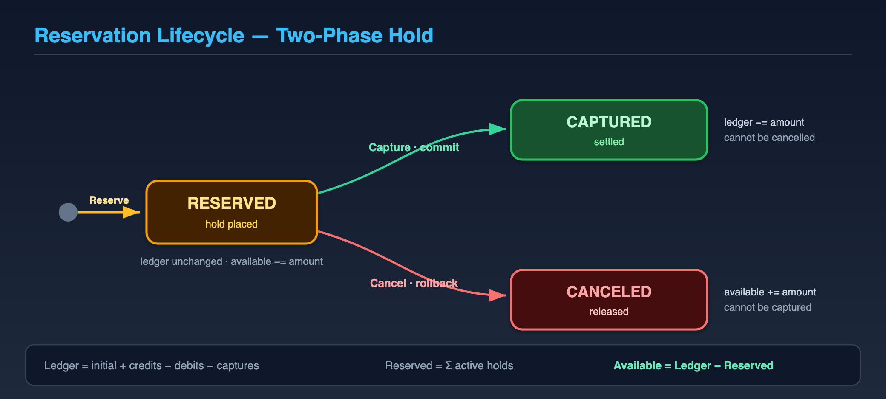

# Account — Business Flows

**Audience:** product, QA, support, and engineers onboarding to the domain.
**Scope:** *what* an account is and *what rules* govern it — independent of how
it is stored or transported. For the runtime mechanics (HTTP, messaging, CDC,
consistency), see [architecture.md](./architecture.md).

> This documents the **account** bounded context. As further contexts are added,
> each gets its own `docs/<context>/` folder, and a top-level context map will
> describe the relationships between them.

---

## What is an Account?

An account holds money in a single currency and exposes a small set of
operations: deposit, withdraw, place a temporary hold on funds, and settle or
release that hold. Every operation either succeeds and changes the account, or
is rejected and changes nothing — there are no partial outcomes.

## The three balances

This is the single most important concept. An account tracks **one** stored
balance, but you reason about **three** numbers:

| Balance | Meaning |
|---|---|
| **Ledger** | The real money in the account: `initial + deposits − withdrawals − captured holds`. |
| **Reserved** | The sum of all *active holds* — money set aside but not yet spent or released. |
| **Available** | What can actually be spent right now: **`Ledger − Reserved`**. |

Withdrawals and new holds are checked against **available**, never ledger — you
cannot spend money that is already on hold.

### Worked example

Starting from an account opened with 100:

| Step | Operation | Ledger | Reserved | Available |
|---|---|---:|---:|---:|
| 1 | Open with 100 | 100 | 0 | 100 |
| 2 | Reserve 30 | 100 | 30 | **70** |
| 3 | Deposit 50 | 150 | 30 | 120 |
| 4a | **Capture** the 30 hold | 120 | 0 | 120 |
| 4b | *(instead)* **Cancel** the 30 hold | 150 | 0 | 150 |

Note step 4a: capturing a hold lowers the **ledger** but leaves **available**
unchanged — the money was already deducted from available back in step 2.
Cancelling (4b) instead returns it to available.

---

## Account lifecycle

An account is `OPENED`, then eventually `CLOSED`. There are no other states.

## Operations at a glance

| Operation | Records the event | Effect |
|---|---|---|
| Open account | `AccountOpened` | Sets currency and initial balance; status → OPENED |
| Deposit (credit) | `FundsCredited` | Ledger and available increase |
| Withdraw (debit) | `FundsDebited` | Ledger and available decrease |
| Reserve funds | `FundsReserved` | Hold placed; available decreases, ledger unchanged |
| Capture reservation | `ReservationCaptured` | Hold settled; ledger decreases, available unchanged |
| Cancel reservation | `ReservationCanceled` | Hold released; available increases, ledger unchanged |
| Close account | `AccountClosed` | Status → CLOSED |

## Rules enforced

The account refuses any operation that would break one of these — and when it
refuses, nothing is recorded:

- You cannot open an account with a negative initial balance.
- Deposits, withdrawals, and reservations must be **positive** amounts in the
  account's currency.
- You cannot withdraw or reserve more than the **available** balance.
- You cannot operate on a **closed** account.
- You can only close an account whose balance is **zero** with **no active
  holds**.
- You cannot cancel a hold you have already captured, nor capture a hold you
  have already cancelled (see below).

---

## Money reservations (two-phase holds)

Some flows need to set money aside *now* and decide *later* whether to take it
or give it back — the same pattern a card terminal uses when it authorises an
amount at checkout and captures it on shipment (or voids it if the order falls
through).

A reservation has three phases:

**Phases are terminal and one-way.** Once a hold is captured it cannot be
cancelled, and once cancelled it cannot be captured. Repeating the *same*
settlement (capture an already-captured hold, or cancel an already-cancelled
one) is harmless and simply has no effect — see "Safe retries".

---

## What happens when a rule is violated

A rejected operation is a clean failure: the account is **not** modified and no
event is recorded. For example, a withdrawal larger than the available balance
is refused outright — the balance does not move and no partial withdrawal
occurs. The caller receives an error describing which rule was broken.

## Safe retries

Every money-moving operation is **safe to retry**. If a deposit, withdrawal, or
reservation request is sent twice (a network blip, an impatient retry), the
account processes it **once** and reports the duplicate as having *no effect* —
you will never double-charge or double-credit. The same is true of capture and
cancel: asking twice produces the same end state as asking once.

*How* this guarantee is implemented (idempotency keys, the read model, delivery
semantics) is described in [architecture.md](./architecture.md).

---

> The diagrams are hand-authored SVGs in [`diagrams/`](./diagrams/); run
> [`render.sh`](./diagrams/render.sh) to re-rasterize them to PNG after editing.

## See also

- [architecture.md](./architecture.md) — runtime flow, consistency, messaging.
- [ADR-001](../adr/001-event-sourced-aggregate-model-for-account-domain.md) — why the account is event-sourced.
- [ADR-006](../adr/006-snapshot-strategy.md) — how account history stays fast to load.
